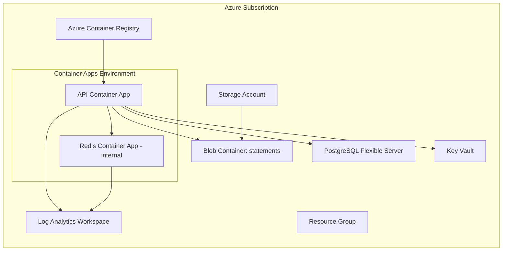

# Secure File Statement Delivery

FastAPI service for secure, time-limited PDF statement delivery.

Quick (Docker-only)

1. Copy env: `cp .env.example .env`
2. Start services: `make up` (runs `docker compose up -d --build`)
3. Stop services: `make down` (`docker compose down -v`)
4. Follow logs: `make logs`

Deployment (API docs):

[https://ca-stmt-api.braveriver-f255919f.southafricanorth.azurecontainerapps.io/docs](https://ca-stmt-api.braveriver-f255919f.southafricanorth.azurecontainerapps.io/docs)

Notes:
- Admin endpoints require `X-API-Key` (set `STATEMENT_API_KEY` in `.env` or as a secret).
- This repo includes tests under `tests/` (run with `pytest`).

Local development (full)

Prerequisites:

- Python 3.14+
- `uv` package manager
- Docker + Docker Compose

Setup:

```bash
# 1. Clone
git clone https://github.com/mazi76erX2/Secure-File-Statement-Delivery.git
cd Secure-File-Statement-Delivery

# 2. Install dependencies
uv sync --all-extras

# 3. Copy env
cp .env.example .env

# 4. Start DB and cache for local development
docker compose up -d db redis

# 5. Run migrations
uv run alembic upgrade head

# 6. Start dev server
uv run uvicorn server.main:app --reload --host 0.0.0.0 --port 8000
```

Tests:

```bash
# Start services if needed
make up

# Run tests
uv run pytest
```

Deployment docs and full project details: see `README_FULL.md`.

## Azure Deployment Guide

### Prerequisites

- Azure CLI logged in (`az login`)
- OpenTofu/Terraform installed
- Docker installed
- Values ready for sensitive inputs: `statement_api_key`, `db_password`, `redis_password`

### 1. Provision Infrastructure

The Azure OpenTofu/Terraform module provisions the production stack: Resource Group, ACR, Key Vault, PostgreSQL Flexible Server, Blob Storage container, Log Analytics Workspace, Container Apps Environment, internal Redis Container App, and public API Container App.

```bash
cd infra/terraform/azure

# Initialize
tofu init

# Plan
tofu plan \
  -var="resource_group_name=<rg-name>" \
  -var="location=southafricanorth" \
  -var="storage_account_name=<globally-unique-storage-name>" \
  -var="acr_name=<globally-unique-acr-name>" \
  -var="key_vault_name=<globally-unique-kv-name>" \
  -var="postgres_server_name=<globally-unique-pg-name>" \
  -var="log_analytics_workspace_name=<law-name>" \
  -var="container_app_environment_name=<cae-name>" \
  -var="container_app_name=<api-app-name>" \
  -var="statement_api_key=<value>" \
  -var="db_password=<value>" \
  -var="redis_password=<value>" \
  -var="app_image=mcr.microsoft.com/azuredocs/containerapps-helloworld:latest"

# Apply
tofu apply \
  -var="resource_group_name=<rg-name>" \
  -var="location=southafricanorth" \
  -var="storage_account_name=<globally-unique-storage-name>" \
  -var="acr_name=<globally-unique-acr-name>" \
  -var="key_vault_name=<globally-unique-kv-name>" \
  -var="postgres_server_name=<globally-unique-pg-name>" \
  -var="log_analytics_workspace_name=<law-name>" \
  -var="container_app_environment_name=<cae-name>" \
  -var="container_app_name=<api-app-name>" \
  -var="statement_api_key=<value>" \
  -var="db_password=<value>" \
  -var="redis_password=<value>" \
  -var="app_image=mcr.microsoft.com/azuredocs/containerapps-helloworld:latest"
```

After apply, capture useful outputs:

```bash
tofu output container_app_url
tofu output acr_login_server
tofu output postgres_fqdn
tofu output storage_account_name
tofu output container_name
tofu output redis_container_app_name
tofu output key_vault_name
```

### 2. Build and Push Docker Image to ACR

Build your API image, push to ACR, then update Terraform `app_image`.

```bash
cd /Users/xolani/Projects/Secure-File-Statement-Delivery
export APP_IMAGE_TAG=latest
ACR_SERVER=$(cd infra/terraform/azure && tofu output -raw acr_login_server)
az acr login --name "${ACR_SERVER%%.azurecr.io}"
docker build -f docker/Dockerfile.prod -t secure-statement-api:$APP_IMAGE_TAG .
docker tag secure-statement-api:$APP_IMAGE_TAG ${ACR_SERVER}/secure-statement-api:$APP_IMAGE_TAG
docker push ${ACR_SERVER}/secure-statement-api:$APP_IMAGE_TAG
```

Point the Container App to the new image:

```bash
cd infra/terraform/azure
tofu apply \
  -var="resource_group_name=<rg-name>" \
  -var="storage_account_name=<globally-unique-storage-name>" \
  -var="acr_name=<globally-unique-acr-name>" \
  -var="key_vault_name=<globally-unique-kv-name>" \
  -var="postgres_server_name=<globally-unique-pg-name>" \
  -var="log_analytics_workspace_name=<law-name>" \
  -var="container_app_environment_name=<cae-name>" \
  -var="container_app_name=<api-app-name>" \
  -var="statement_api_key=<value>" \
  -var="db_password=<value>" \
  -var="redis_password=<value>" \
  -var="app_image=${ACR_SERVER}/secure-statement-api:${APP_IMAGE_TAG}"
```

### Azure Architecture



## CI/CD Pipeline

The repository includes GitHub Actions workflows for continuous integration.

### Workflow: Format, Lint, Type-check, Test

**Triggers:** Push/PR to `main` or `master`

**Steps:**

1. Checkout code
2. Install uv package manager
3. Setup Python 3.14
4. Install dependencies (`uv sync --all-extras`)
5. Format check (`ruff format --check .`)
6. Lint (`ruff check .`)
7. Type check (`mypy server`)
8. Test suite (`pytest`)

### Running CI Checks Locally

```bash
# Run all checks (same as CI)
uv run ruff format --check .
uv run ruff check .
uv run mypy server
uv run pytest
```

## Troubleshooting

### Container Startup Issues

**Problem:** Backend fails to connect to database

```
Connection refused: db:5432
```

**Solution:** The entrypoint waits for DNS resolution and port availability. If issues persist:

```bash
# Check container logs
docker compose logs backend

# Verify database is healthy
docker compose ps

# Restart with fresh volumes
docker compose down -v && docker compose up -d
```

### MinIO Encryption Errors

**Problem:** Terraform fails with "NotImplemented" on bucket encryption

```
Error: error putting S3 Bucket Server Side Encryption: NotImplemented
```

**Solution:** MinIO without KMS doesn't support SSE. Set:

```hcl
enable_bucket_encryption = false  # default
```

### OpenTofu Azure backend `403 AuthorizationFailed` on `listKeys`

**Problem:**

`tofu init` fails with:

`Microsoft.Storage/storageAccounts/listKeys/action`

**Why:**

Your identity does not have permissions to use storage account keys for the remote state backend.

**Fix (recommended, least privilege):**

This repository now uses Entra ID auth for the Azure backend (`use_azuread_auth = true`).
Grant your identity a Blob data-plane role on the state storage account:

```bash
# set values
SUBSCRIPTION_ID="563e3a21-bb51-4f11-a4ed-b3124b09f5e8"
RESOURCE_GROUP="rg-tfstate"
STORAGE_ACCOUNT="tfstatemazi"

# get your current principal object id
ASSIGNEE_OBJECT_ID=$(az ad signed-in-user show --query id -o tsv)

# scope to the storage account
SCOPE=$(az storage account show \
  --name "$STORAGE_ACCOUNT" \
  --resource-group "$RESOURCE_GROUP" \
  --query id -o tsv)

# allow backend state read/write via Azure AD (no account keys required)
az role assignment create \
  --assignee-object-id "$ASSIGNEE_OBJECT_ID" \
  --assignee-principal-type User \
  --role "Storage Blob Data Contributor" \
  --scope "$SCOPE"

# refresh token and retry
az account set --subscription "$SUBSCRIPTION_ID"
az login
cd infra/terraform/azure
tofu init -reconfigure -input=false
```

If you authenticate with a service principal in CI/CD, assign the same role to that service principal object id.

### OpenTofu Azure backend `403 AuthorizationPermissionMismatch` on `ListBlobs`

**Problem:**

`tofu init -reconfigure -input=false -backend-config="use_azuread_auth=true"` fails with:

`containers.Client#ListBlobs ... Code="AuthorizationPermissionMismatch"`

**Why:**

The CI identity can authenticate to Azure, but it is missing Blob data-plane permissions on the remote state container/account.

**Fix:**

Assign `Storage Blob Data Contributor` to the GitHub Actions service principal (the app id used by `AZURE_CREDENTIALS`) on the state storage account scope:

```bash
az role assignment create \
  --assignee "<github-actions-client-id>" \
  --role "Storage Blob Data Contributor" \
  --scope "/subscriptions/563e3a21-bb51-4f11-a4ed-b3124b09f5e8/resourceGroups/rg-tfstate/providers/Microsoft.Storage/storageAccounts/tfstatemazi"
```

Then wait a few minutes for RBAC propagation and re-run the workflow.

### OpenTofu `403 Forbidden` reading Key Vault secrets

**Problem:**

OpenTofu fails while refreshing `azurerm_key_vault_secret` resources with:

`does not have secrets get permission on key vault`

**Why:**

The CI service principal can access Azure resources, but it does not have Key Vault secret data-plane permissions.

**Fix:**

Grant secret permissions to the deploy principal on the Key Vault:

```bash
az keyvault set-policy \
  --name "<key-vault-name>" \
  --spn "<github-actions-client-id>" \
  --secret-permissions get list set delete
```

Then re-run the workflow.

### PDF Download Fails

**Problem:** 401 or 410 errors when downloading

**Possible causes:**

1. **401 - Invalid ID number:** Verify `X-ID-Number` header matches customer's ID
2. **410 - Link expired:** Token has expired or max downloads reached
3. **404 - Invalid token:** Token doesn't exist or was revoked

```bash
# Check link status (admin)
curl http://localhost:8000/statements/{customer_id} \
  -H "X-API-Key: $STATEMENT_API_KEY"
```

### LGTM Stack Issues

**Problem:** Loki fails to start

```
permission denied: /loki/wal
```

**Solution:** Fixed in `loki.yml`. If persisting, ensure volumes are clean:

```bash
docker compose -f docker-compose.lgtm.yml down -v
docker compose -f docker-compose.lgtm.yml up -d
```

### Azure Postgres/Redis connectivity issues

If running in Azure with managed services:

- Ensure `DATABASE_SSL_MODE=require`
- Ensure `CACHE_USE_SSL=false` for internal Container Apps Redis traffic
- Ensure `CACHE_HOST` matches the Redis container app name (default `ca-redis`)
- Ensure `CACHE_PORT=6379` and `CACHE_PASSWORD` is set from `AZURE_REDIS_PASSWORD`
- Keep `CACHE_SSL_CERT_REQS=none` for the internal Redis container app setup

### Database Migration Errors

**Problem:** Alembic migration fails

```bash
# Check current revision
uv run alembic current

# Show migration history
uv run alembic history

# Downgrade if needed
uv run alembic downgrade -1

# Re-run upgrade
uv run alembic upgrade head
```
